# Détection d'objets *Single Shot Multibox Detector* (SSD) 

#### Contenu

- [Description du modele](#description-du-modele)
    - [Fonction objective](#fonction-objective)
    - [Parametres du modèle](#parametres-du-modele)
- [Experimentations](#experimentations)
    - [Methodologie](#methodologie)
    - [Materiel](#materiel)
    - [Resultats](#resultats)
- [Utilisation](#utilisation)
    - [Generation des donnees](#generation-des-donnees)
    - [Apprentissage](#apprentissage)
    - [Evaluation](#evaluation)

La majorité du code se base sur l'[implémentation](https://github.com/pierluigiferrari/ssd_keras) réalisée par Pierluigi Ferrari (862 Forks).

Ce projet présente une comparaison des performances du réseau SSD basé sur différents *backbones*. Puisque le *backbone* correspond à un réseau de classification d’image tronqué avant les étapes de prédiction, nous supposons que ses performances en classification peuvent être transférables au réseau SSD. Ainsi, en mesurant les performances de plusieurs réseaux SSD se basant sur divers *backbones*, on étudierait l’impact de ce paramètre sur les performances de détection du réseau.

Le problème traité correspond donc à de la détection dans une image. Le réseau prend en entrée une image brute, et nous retourne une liste de valeurs correspondant aux objets détectés dans l'image par le réseau. Ces valeurs correspondent à:
- La classe de l'objet
- La valeur de confiance attribuée par la présence de cet objet dans le cadre englobant
- Les coordonées du cadre englobant: *xmin*, *ymin*, *xmax*, *ymax*

## Description du modele

Le réseau SSD se base sur un réseau convolutionnel de classification d’image pour produire une collection de cadres englobants de tailles fixes associés à des scores d’appartenance à chaque catégorie d’objet, puis suivi par des étapes de suppression des cadres non pertinents pour produire la décision finale.

La première partie correspond donc au *backbone* dont le principal rôle est d'extraire les caractéristiques de l'image. Dans notre cas, c'est ce paramètre que l'on souhaite manipuler. A l'issue de cette première partie, on ajoute plusieurs couches convolutionnelles pour diminuer progressivement la taille des *features maps*, sur lesquels on applique deux types de filtres convolutionnels:
- le premier spécifique à la localisation de l'objet dans l'image
- le second spécifique à la classification de cet objet

Enfin, à chaque cellule d’une feature map est associé un ensemble de cadres englobants de référence différents, de manière à ce que la position relative d’un cadre par rapport à la cellule correspondante soit fixe. Ainsi, la méthode SSD permet de prédire les décalages des cadres englobants par rapport aux cadres par défaut pour chaque cellule d’une feature map, ainsi que les probabilités associées à la présence d’un objet dans la cellule, et ce pour de chaque classe entraînée.

### Fonction objective

La stratégie de matching entre la vérité terrain et les mesures effectuées par le réseau consiste d’abord à établir une correspondance entre le cadre de la vérité terrain avec le cadre par défaut présentant la meilleure mesure de recouvrement de Jaccard. Ensuite, ne sont retenus que les cadres englobants ayant une mesure de recouvrement de Jaccard avec n’importe quelle vérité terrain de l’image supérieure à 0.5 (dans le but d’autoriser le chevauchement entre deux cadres).

La fonction objective globale est une somme pondérée de la fonction objective de localisation (loc) et de la fonction objective de confiance (conf).

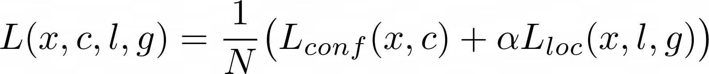

où *N* est le nombre de cadres englobants correspondant à une vérité terrain, et *x* un indicateur de correspondance entre les cadres de référence et le cadre de la vérité terrain (1 s’il y a une correspondance entre le i-ème cadre de référence et le j-ème cadre de vérité terrain pour la catégorie p, sinon 0).

La fonction objective de localisation est une fonction *smooth L1*, *l* correspondant au cadre englobant prédit et *g* au cadre de la vérité terrain. La fonction objective de confiance est une fonction *softmax*, où *c* fait référence aux probabilités d’appartenance à de multiples classes. On ne détaillera pas l’ensemble de ces fonctions, davantage de développement sont disponibles dans l’article original.

### Parametres du modele

#### Cadres englobants de référence

Le réseau SSD souhaite utiliser les features maps des couches convolutionnelles situées aussi bien au début de l’architecture qu’à la fin. Combiner ces couches permet d’utiliser au mieux les informations globales et locales nécessaires à la segmentation de l’image.
Cependant, les features maps sont de tailles différentes, c’est pourquoi il faut adapter la taille des cadres englobants en utilisant des échelles spécifiques à chaque feature map. Si on utilise *m* features maps pour la prédiction, l’échelle des cadres de référence pour chacune d’entre elle est calculé ainsi :

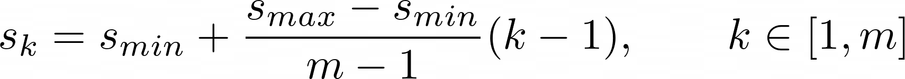

avec *Smin* et *Smax* compris entre 0 et 1.

Afin d’obtenir une famille variée de cadres englobants, on définit des coefficients de ratio (*aspect ratios*) permettant de calculer la hauteur et la largeur de chaque cadre englobant et pour chaque feature map.

#### Data augmentation et hard negative mining

Afin de rendre le réseau plus robuste aux différentes tailles et formes d’objet en entrée, chaque image est aléatoirement échantillonnée grâce à une méthode parmi trois possibles. Après une série d’opérations de preprocessing, l’image d’entrée est redimensionnée à une taille fixe et renversée horizontalement avec une probabilité de 0.5. L’ensemble de ce procédé est défini comme une augmentation des données.

Après avoir fourni une image au réseau, ce dernier se retrouve avec une quantité importante de cadres englobants, la plupart étant négatifs ce qui entraîne un déséquilibre du ratio des exemples d’apprentissage négatifs / positifs. Plutôt que d’utiliser l’ensemble des exemples négatifs, le réseau utilise uniquement ceux ayant la plus petite loss de classification, de manière à ce que le ratio négatifs / positifs soit de 3:1. C’est ce qu’on appelle l’extraction des négatifs (*hard negative mining*).

### Référence

[1] W. Liu et al., «SSD: Single Shot MultiBox Detector», [arXiv:1512.02325](https://arxiv.org/pdf/1512.02325.pdf), vol. 9905, p. 21‑37, 2016, doi: 10.1007/978-3-319-46448-0_2.

## Experimentations

### Methodologie

Pour nos données d'entraînement  et de validation, nous avons decidé de combiner respectivement les données d'entraînement et de validation de PASCAL VOC 2007 et 2012. Ces données sont accessibles, et cela nous ont donné beaucoup d'exemples d'apprentissage. Les données de test, elles, sont les données de test de PASCAL VOC 2007.
Chaque backbone que nous avons utilisé avait des poids pré-entraînés sur les données d'ImageNet. Nous avons testé les quatres backbones suivants:
- VGG16
- VGG19
- InceptionV3
- ResNet50

Nos expériences se sont réalisées avec le même nombre d'epochs (10) et la même taille de batch (32), dans un soucis de comparaisons des résultats.

Pour chaque entraînement de modèle, les paramètres utilisés sont les mêmes que ceux spécifiés dans l'article original (expérimentations sur le dataset VOC2007). La seule modification apportée correspond aux valeurs de centrage des données, puisque nous effectuons l'apprentissage uniquement sur les ensembles de données *train* et non *trainval*.

### Materiel

Devant entraîner le réseau de grande taille qu'est SSD, il nous était nécessaire d'accéder aux GPUs du CRIANN. Cet accès se fait par connexion SSH, cependant, la crise du COVID nous a empêché d'établir cette connexion depuis les postes de l'université, nous condamnant à utiliser une IP Fixe.

Il est important de noter que la durée d'exécution pour nos entraînements était plafonnée à 48 heures par le CRIANN, ce qui est peu pour SSD qui bénéficierait plus d'une durée d'entraînement de l'ordre d'une semaine.

Pour utiliser les GPUs du CRIANN, nous avons dû nous y connecter par SSH, cloner notre repository GitHub, et réaliser un fichier batch. Ce fichier comporte les options de lancement d'un job sur les GPUs (comme la durée d'exécution prévue, la mémoire dont on a besoin, l'adresse mail à laquelle envoyer les notifications, quel partition utiliser, où écrire les logs, etc...). Ce fichier contient également le chargement d'un environnement d'exécution et la commande de lancement du fichier que l'on veut exécuter.

### Resultats

Les courbes d'évolutions de la *loss* nous montrent bien une diminution de cette dernière, signe que le réseau apprend.

|            VGG16           |            VGG19           |            ResNet 50          |          Inception V3          |
| :------------------------: | :------------------------: | :---------------------------: | :----------------------------: |
| 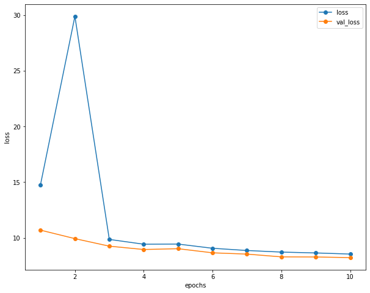 | 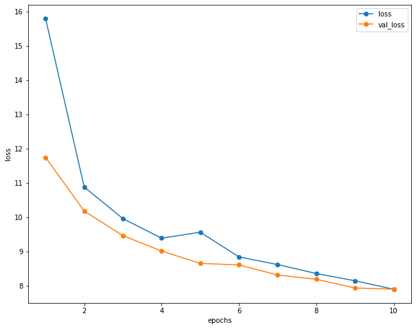 | 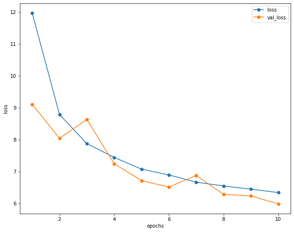 | 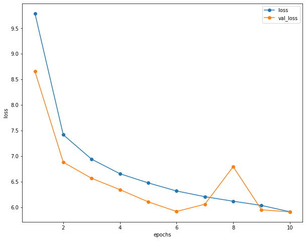 |


On observe pour VGG16 qu'elle descend jusqu'à 8.5 ce qui nous montre qu'avec plus d'epochs, on obtiendrait surement des valeurs encore plus faibles et donc meilleures. Notons qu'à l'epoch 2, notre *loss* d'entrainement augmente fortement jusqu'à une valeur absurde de 30, pour ensuite reprendre des valeurs cohérentes. Alors que la *loss* de validation décroît sans ce problème. nous ne saurions pas expliqué ce phénomène, qui, cependant, n'influt pas sur l'aspect général de nos pertes qui ont un bon comportement de descente.

Pour notre modèle avec le backbone VGG19 nos deux *loss* décroient bien et plus fortement que VGG16, avec une *loss* final de 8. Bien qu'à l'epoch 5, notre *loss* d'entrainement connaît une légère augmentation, la courbe globale respecte bien une descente de perte, avec la validation légèrement inférieur à la courbe d'entrainement.

Concernant le backbone resnet50, notre courbe d'évolution d'entrainement est bien décroissante à chaque epoch. Bien que sur notre *loss* de validation, on observe deux augmentations inattendu aux cours des epochs 3 et 7. Mais elle reste bien inférieur à celle de train pour atteindre une valeur minimale de 6,3 mieux que celle de VGG19.

Notre backbone inception_v3 obtient la plus petite *loss* au terme de ces 10 epochs. La *loss* de validation et d'entrainement décroît jusqu'à 5.9. Cependant, à l'epoch 8 notre courbe pour la validation connaît une augmentation, comme chacun pour chacun de nos modèles, nous ne savons pas pourquoi cela apparaît. Mais les deux courbes ci-dessus nous montre une belle évolution de la perte.

Nos courbes d'évolution de la *loss* sont globalement satisfaisantes et montrent que l'entrainement du modèle se passe bien. Bien que nous ayons quelques valeurs absurdes pour chacun des modèles, cela n'impact pas notre descente. En suivant ces évolutions nous pourrions émettre l'hypothèse que notre modèle avec le backbone de inception_v3 est légèrement plus performant. Nous allons voir cela en détails avec la précision des modèles.

|   Classes    |    VGG16     |    VGG19     |  ResNet 50   | Inception V3 |
| :----------- | -----------: | -----------: | -----------: | -----------: |
| aeroplane    |    0.000     |    0.008     |     0.155    |     0.207    |
| bicycle      |    0.000     |    0.000     |     0.073    |     0.124    |
| bird         |    0.000     |    0.000     |     0.046    |     0.092    |
| boat         |    0.000     |    0.000     |     0.013    |     0.094    |
| bottle       |    0.000     |    0.000     |     0.000    |     0.091    |
| bus          |    0.000     |    0.000     |     0.014    |     0.213    |
| car          |    0.000     |    0.000     |     0.321    |     0.280    |
| cat          |    0.000     |    0.026     |     0.074    |     0.154    |
| chair        |    0.000     |    0.000     |     0.028    |     0.097    |
| cow          |    0.000     |    0.000     |     0.061    |     0.123    |
| diningtable  |    0.000     |    0.000     |     0.131    |     0.030    |
| dog          |    0.000     |    0.018     |     0.085    |     0.200    |
| horse        |    0.000     |    0.000     |     0.122    |     0.150    |
| motorbike    |    0.000     |    0.000     |     0.203    |     0.127    |
| person       |    0.059     |    0.034     |     0.312    |     0.301    |
| pottedplant  |    0.000     |    0.000     |     0.091    |     0.024    |
| sheep        |    0.000     |    0.000     |     0.126    |     0.187    |
| sofa         |    0.000     |    0.000     |     0.127    |     0.112    |
| train        |    0.000     |    0.000     |     0.138    |     0.046    |
| tvmonitor    |    0.000     |    0.091     |     0.151    |     0.171    |
| **mAP**      |  **0.003**   |  **0.008**   |   **0.120**  |   **0.141**  |

**Précision** : C'est le nombre de données correctement attribué à la classe (Vrais Positifs) sur le nombre de données total attribué à cette classe (Vrais Positifs + Faux positifs). Cela nous montre si notre modèle est précis pour chaque classe et globalement avec la moyenne de ces precisions. 

Pour VGG16, le modèle classe toutes les images de test dans la classe 15 (Person) et nous donne donc des précisions totalement faussées avec une valeur de 0 pour les classes non prédite. Ce qui nous donne une moyenne des precisions globale à moins de 1%. 

Pour le backbone VGG19, le modèle nous prédit que des données dans certaines classes. En effet, nous avons 93% des predictions dans la classe 15. Ce qui, comme pour VGG16, nous fausse nos précisions, avec une moyenne des précisions globale à moins de 1% pour VGG19 aussi.

Pour le backbone resnet50, nos résultats sont plus intéressants. En effet, le modèle à bien prédit des détections sur chacune des classes et nos valeurs de précision sont cohérentes. Pour la classe 15, étant la plus représentée, notre taux de précision est de 31%. Notre classe la mieux prédite est la classe Car pour un taux de précision de 32%. La classe Bottle à 0% de précision alors que nous avons des données prédite, ce qui montre l'inéficacité totale à prédire une détection de bouteille dans une image.
Enfin, la moyenne de ces précisions est de 12%, ce qui montre que notre modèle ne prédit pas précisemment du tout les detections pour nos images.

Pour le backbone inception_v3, nous obtenons notre meilleur modèle en terme de précision, pour un taux total de 14%, ce qui reste trop faible. 
En effet, notre modèle prédit dans toutes les classes, avec un taux de précision de 30% sur notre classe la plus représenté (Person). Certaines classes sont toujours très dur à prédire comme Bird, Boat, Bottle ou DinnerTable (Table à manger). Cela confirme notre analyse des courbes de la *loss*, qui montrait une tendance pour le backbone inception_v3.


Le *backbone* permet de construire les features maps de chaque image. Ces résultats nous permettent de voir quel backbone construit le mieux ces features maps pour permettre aux couches suivantes de bien prédire les détections. Il faut prendre en compte que notre entrainement n'a été effectué que sur 10 epochs, et cela affecte grandement les performances.

Pour cet entrainement, on observe que les backbone VGG (16 et 19) construisent très mal les features maps, parce que nous ne pouvons pas détecter autre chose que des personnes. 
Les backbones resnet50 et inception_v3 nous permettent de prédire des détections pour chacune des classes, ce qui montre que les modèles ont mieux appris qu'avec les backbone VGG. Néanmoins, les performances de ces deux modèles sont très faibles avec pas plus de 14% de taux de précision global et 32% pour la classe la mieux prédite.

Peut être qu'avec un entrainement avec plus d'epochs, nos modèles avec les backbones VGG16 et VGG19 auraient dépassés les performances des deux autres au fil des epochs, Néanmoins pour un entrainement de cette taille, resnet50 et inception_v3 sont plus performants.

#### Visualisation des résultats

Le tableau ci-dessous présente les résultats obtenus en fonction de chaque backbone utilisé.
Comme décrit précédemment, on observe bien que les réseaux ayant comme *backbone* VGG16 et VGG19 ne détectent
aucun objet dans les images, alors qu'avec les *backbones* ResNet50 et Inception V3

|    VGG16     |    VGG19     |  ResNet 50   | Inception V3 |
| :----------: | :----------: | :----------: | :----------: |
|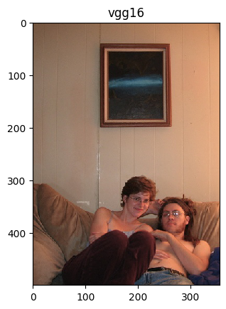|||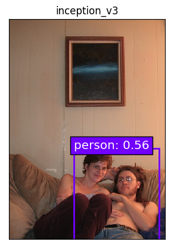|
|||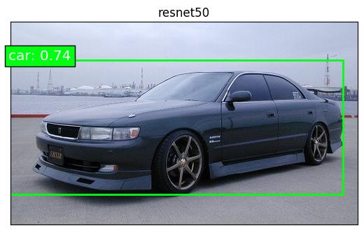|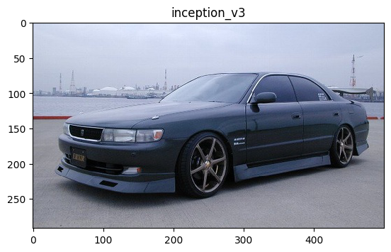|
|||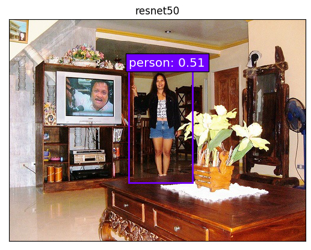|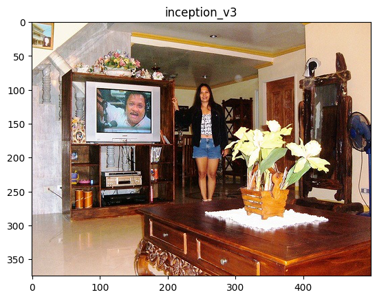|

Et quelques cas pour lesquels ça ne fonctionne pas vraiment...
|  |  |  |
| :----------: | :----------: | :----------: |
|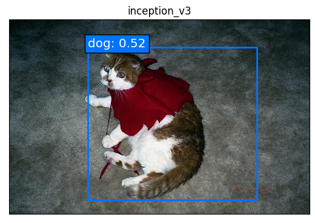|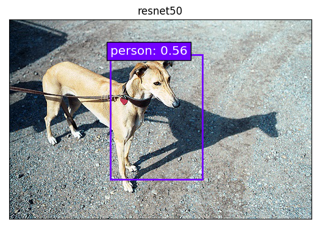|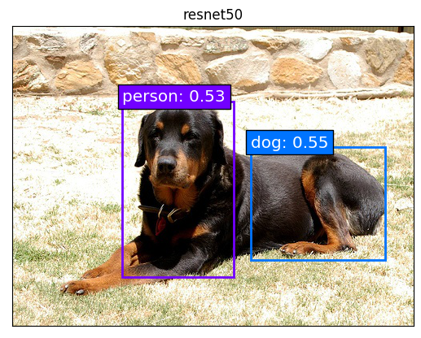|

## Utilisation

### Generation des donnees

Importer les données Pascal VOC dans un nouveau dossier `./data` du projet. On doit retrouver l'architecture suivante:

```shell script
.
+-- bounding_box_utils
+-- data
    +-- VOC2007
        +-- Annotations
        +-- ImageSets/Main
        +-- JPEGImages
    +-- VOC2012
        +-- Annotations
        +-- ImageSets/Main
        +-- JPEGImages
+-- data_generator
+-- ...
```

Quand les données sont présentes dans le projet, vous pouvez lancer la commande suivante depuis votre terminal, en spécifiant le(s) ensemble(s) de données que vous voulez générer.

```shell script
python3 convert_data.py -n train test valid
```

Cela permettra de générer les datasets d'entraînement, de validation et de test au format *.h5*, plus simple à utiliser pour la suite.

### Apprentissage

Pour lancer un apprentissage, il faut exécuter le fichier [training.py](training.py) avec trois arguments obligatoires :
- le nom du backbone (argument `-b`)
- la taille du batch (argument `-s`)
- le nombre d'epochs (argument `-n`)

Liste des backbones disponibles:
- VGG16 (`vgg16`)
- VGG19 (`vgg19`)
- ResNet50 (`resnet50`)
- InceptionV3 (`inception_v3`)

```shell script
python3 training.py -b vgg16 -s 32 -n 100
```

**Attention**

Pour réussir à charger les poids de ResNet50 et InceptionV3, il faut downgrade la version de *h5py* (`pip3 install 'h5py<3.0.0'`).

### Evaluation

Pour évaluer un modèle, il suffit simplement d'exécuter le fichier [evaluation.py](evaluation.py) avec les paramètres de nom du backbone et de taille du batch.

```shell script
python3 evaluation.py -b vgg16 -s 8
```
